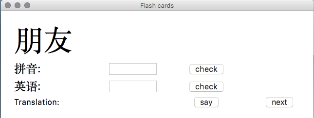
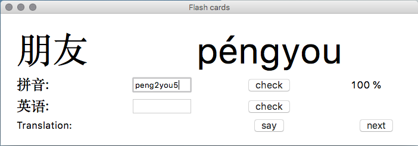
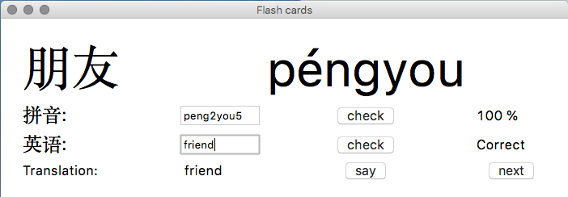

Hanyu Shuiping Kaoshi flashcard
===============================================

The Hànyǔ Shuǐpíng Kǎoshì (HSK) is China's only standardised test of Standard Chinese language proficiency for non-native speakers.

The test is administered by Hanban, an agency of the Ministry of Education of the People's Republic of China.

This flashcard application is meant for exercising to the test.

## Syntax and example

To start, write

    $ python3 main.py hsk_level
  
in your terminal, where `hsk_level` is an integer between 1 and 6. A window will appear, as shown below.

First, the program displays the 汉字, while you have to input the Pinyin. The program uses numbers for writing tones, as shown in

*Description * | First tone | Second Tone | Third Tone | Forth Tone | Neutral
--- | --- | --- | --- | --- | --- 
Pinyin Example | mā | má | mǎ | mà | ma
Program Example | ma1 | ma2 | ma3 | ma4 | ma5

The correct answer for the figure below is

The program also checks that you have gotten the correct meaning of the word.

If using MacOS, the built-in system voice for Chinese can be used to practice pronunciation.
